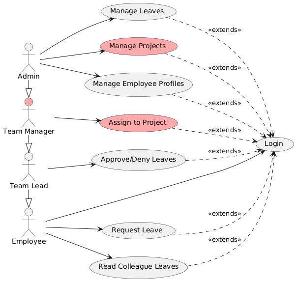
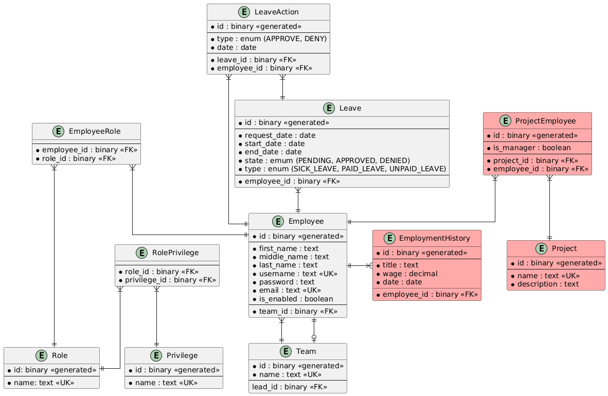

# Employee Management System

## Overview

This project is an Employee Management System designed to streamline various HR and administrative tasks. It provides functionalities for managing employee profiles, leaves, projects, and roles within an organization. 
The system is designed to cater to different roles such as Admin, <del>Team Manager</del>, Team Lead, and Employee, each with specific permissions and responsibilities.

Team Manager functionality will be realized in future releases and is marked in red.

## Features

### Use Cases

1. **Manage Leaves**: Admins have the capability to manage and monitor leave requests and approvals.
2. <del>**Manage Projects**</del>: Admins can create, update, and delete projects.
3. **Manage Employee Profiles**: Admins can create, update, and delete employee profiles.
4. <del>**Assign to Project**</del>: Project Managers can assign employees to projects.
5. **Approve Leaves**: Team Leads can give approvals or reject leave requests made by employees.
6. **Request Leave**: Employees can request leave for a specific period.
7. **Read Colleague Leaves**: Employees can view the leave status of their colleagues.
8. **Login**: All users need to log in to access the system.

### Actors

- **Admin**: Has the highest level of access, capable of managing employees, leaves, and projects.
- <del>**Team Manager**</del>: Can manage project assignments and oversee project progress.
- **Team Lead**: Can approve or reject leave requests and is a point of contact for the team.
- **Employee**: Can request leaves and view colleague leave statuses.

## Entity-Relationship Diagram

## Entity Description

- **Employee**: Stores personal details of employees and user information required for login and authentication.
- **EmployeeRole**: Links users to their respective roles.
- **Role**: Defines different roles within the system such as Admin, Project Manager, etc.
- **RolePrivilege**: Links roles to privileges
- **Privilege**: Defines the privileges each role has within the system.
- **Team**: Represents teams within the organization and their leads.
- **Leave**: Details of leave requests made by employees.
- **LeaveAction**: Tracks actions taken on leave requests.
- <del>**EmploymentHistory**</del>: Tracks the employment history of employees including title and wage.
- <del>**Project**</del>: Details of projects managed within the organization.
- <del>**ProjectEmployee**</del>: Links employees to projects and indicates if they are project managers.